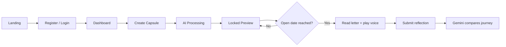
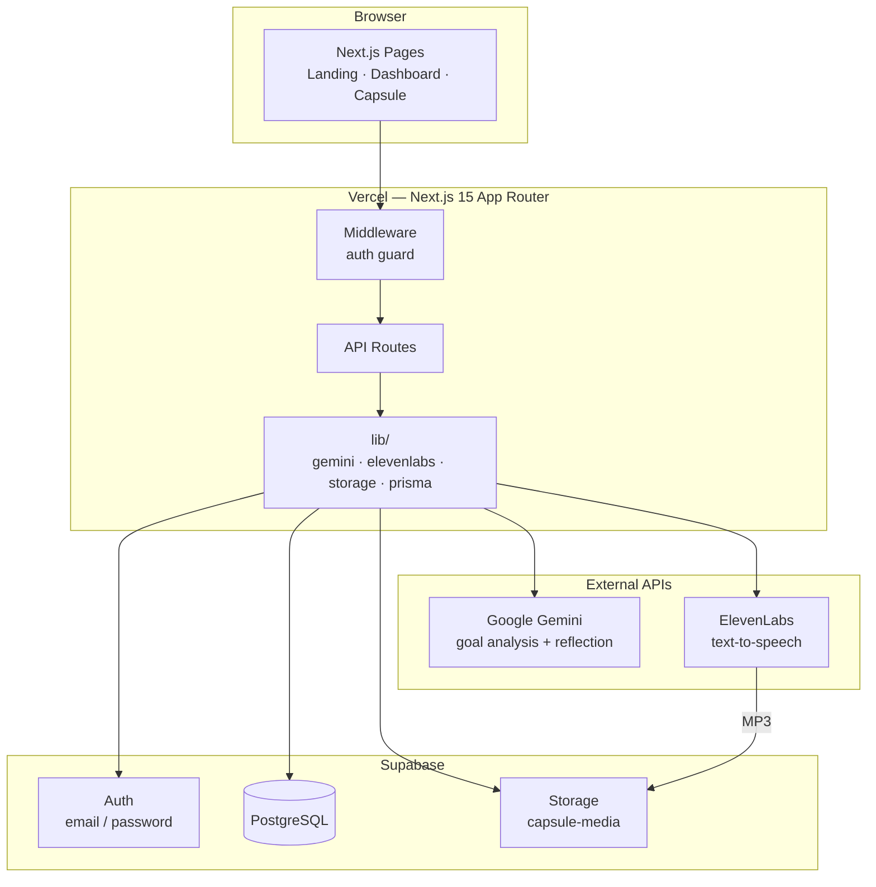
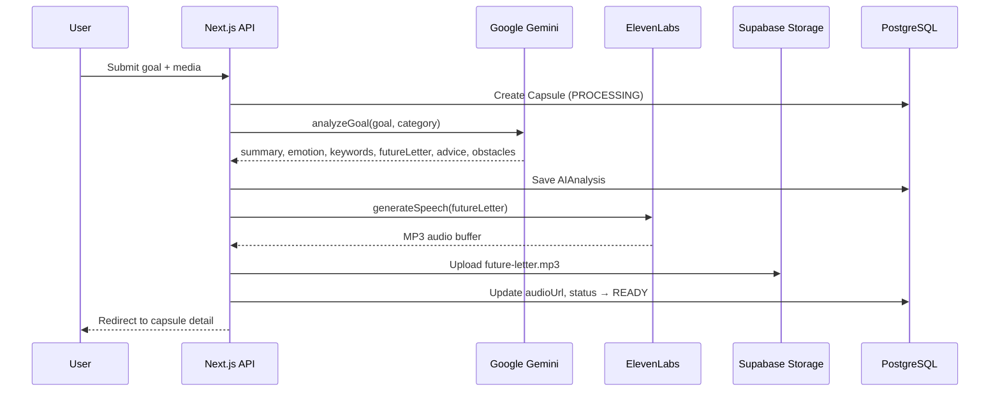
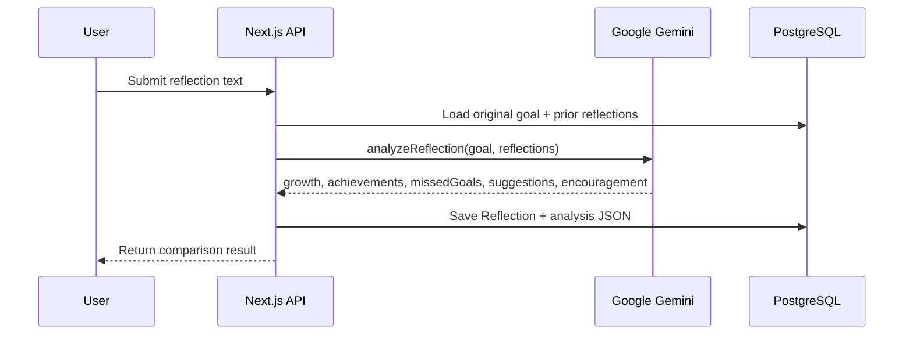
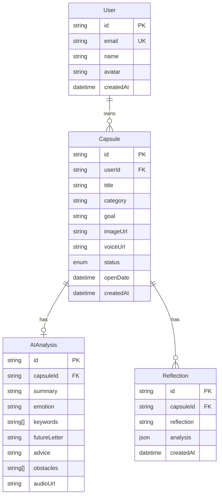
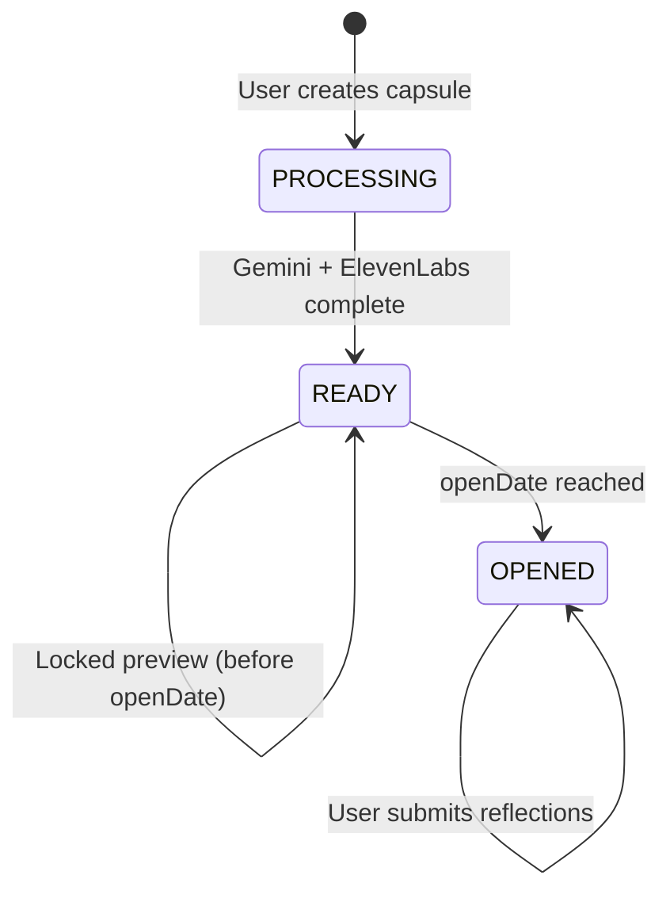

# EchoPass

**Capture your passion today. Meet your future self tomorrow.**

> Submission for **Build Something Inspired by Passion** — a weekend challenge about the fire that drives us.

---

## The Idea

Passion fades. Goals get buried. The excitement you feel today — starting a side project, chasing a promotion, learning a new craft — quietly disappears under daily life.

**EchoPass** is a passion time capsule. You capture a moment of drive through text, voice, or images. AI transforms it into a personalized capsule: a summary, emotional fingerprint, future letter, and spoken message from your future self. When you reopen it months later, AI compares who you were with who you've become.

It's not a todo app. It's a letter across time — from the you who still believed, to the you who needs to remember why you started.

---

## Challenge Fit: Passion

| Theme                               | How EchoPass addresses it                                                               |
| ----------------------------------- | --------------------------------------------------------------------------------------- |
| **Passion as fuel**                 | Users seal their goals, dreams, and raw emotion at peak motivation                      |
| **Obsession & devotion**            | Voice recordings, images, and long-form goals preserve the _feeling_, not just the task |
| **Late-night side projects**        | Built for personal pursuits — coding, music, sport, art, startups                       |
| **The rivalry with your past self** | Future reflection compares original ambition vs. where you are now                      |

---

## Prize Categories

### Best use of Google AI

Gemini powers the emotional core of every capsule:

- **Goal analysis** — structured JSON with summary, emotion, keywords, future letter, obstacles, and advice
- **Future reflection** — compares original goals with later reflections; returns growth, achievements, missed goals, and encouragement
- **Model:** `gemini-2.5-flash-lite` (with automatic fallback across Gemini models)

```
User goal → Gemini → { summary, emotion, futureLetter, advice, obstacles }
Later reflection → Gemini → { growth, achievements, missedGoals, suggestions, encouragement }
```

### Best use of ElevenLabs

The future letter isn't just text — it's **heard**:

- Gemini writes a warm, personal letter from future-you
- ElevenLabs TTS converts it to natural speech (MP3)
- Stored and played back when the capsule unlocks

This makes reopening a capsule a visceral moment: you don't just read what you wanted — you _hear_ it.

---

## Features

- **Auth** — email/password register & login (Supabase)
- **Create Capsule** — title, passion category, goal, optional image & voice recording (up to 60s), scheduled open date
- **AI Processing** — Gemini analyzes the goal; ElevenLabs generates voice
- **Locked Preview** — before open date: see summary, emotion, keywords; future letter & voice stay sealed
- **Future Reflection** — after open date: submit reflections; AI compares journey over time (multiple reflections supported)
- **Dashboard** — all capsules with status, emotion badges, and countdown

---

## User Flow



---

## System Architecture



| Layer          | Responsibility                                                          |
| -------------- | ----------------------------------------------------------------------- |
| **Client**     | React UI, voice recorder, audio player, locked/unlocked capsule views   |
| **Middleware** | Protects `/dashboard` and `/capsule/*`; redirects unauthenticated users |
| **API Routes** | Auth, capsule CRUD, AI analyze, voice generate, reflection              |
| **Supabase**   | Identity, relational data (via Prisma), media files                     |
| **Gemini**     | Structured JSON analysis + future letter + reflection comparison        |
| **ElevenLabs** | Converts future letter to spoken MP3                                    |

---

## AI Pipeline

Capsule creation triggers a two-step AI pipeline:



**Reflection flow** (after open date):



---

## Data Model



### Capsule lifecycle



| Status       | What the user sees                                        |
| ------------ | --------------------------------------------------------- |
| `PROCESSING` | Processing animation while AI runs                        |
| `READY`      | Summary, emotion, keywords visible; letter & voice sealed |
| `OPENED`     | Full future letter, audio player, reflection form         |

---

## Tech Stack

| Layer     | Technology                                  |
| --------- | ------------------------------------------- |
| Framework | Next.js 15 (App Router), TypeScript         |
| UI        | Tailwind CSS, shadcn/ui, Framer Motion      |
| Database  | Supabase PostgreSQL + Prisma                |
| Auth      | Supabase Auth (email/password)              |
| Storage   | Supabase Storage (`capsule-media`)          |
| AI        | Google Gemini API (`@google/generative-ai`) |
| Voice     | ElevenLabs Text-to-Speech API               |
| Deploy    | Vercel                                      |

---

## Getting Started

### 1. Clone & install

```bash
git clone https://github.com/thanhITSW/EchoPass.git
cd EchoPass
npm install
```

### 2. Environment variables

```bash
cp .env.example .env.local
```

| Variable                        | Source                                                   |
| ------------------------------- | -------------------------------------------------------- |
| `DATABASE_URL` / `DIRECT_URL`   | Supabase → Connect → ORM → Prisma                        |
| `NEXT_PUBLIC_SUPABASE_URL`      | Supabase → Settings → API                                |
| `NEXT_PUBLIC_SUPABASE_ANON_KEY` | Supabase → Settings → API (anon key)                     |
| `SUPABASE_SERVICE_ROLE_KEY`     | Supabase → Settings → API (service_role)                 |
| `GEMINI_API_KEY`                | [Google AI Studio](https://aistudio.google.com/apikey)   |
| `GEMINI_MODEL`                  | `gemini-2.5-flash-lite` (recommended for free tier)      |
| `ELEVENLABS_API_KEY`            | [ElevenLabs](https://elevenlabs.io) → Profile → API Keys |
| `ELEVENLABS_VOICE_ID`           | ElevenLabs → Voices → copy Voice ID                      |

### 3. Supabase setup

- **Authentication → Providers → Email** — enable; disable "Confirm email" for local dev
- **Storage** — create public bucket `capsule-media`

### 4. Database & run

```bash
npm run db:migrate
npm run dev
```

Open [http://localhost:3000](http://localhost:3000).

---

## Project Structure

```
app/
  page.tsx                    # Landing
  login/ | register/          # Auth pages
  dashboard/                  # Capsule grid
  capsule/new/                # Create form
  capsule/[id]/               # Detail (locked/unlocked)
  capsule/[id]/processing/    # AI pipeline
  api/
    auth/                     # Register & login
    capsule/                  # CRUD
    ai/analyze/               # Gemini analysis
    voice/generate/           # ElevenLabs TTS
    reflection/               # Future reflection
components/
  capsule/   dashboard/   auth/   player/   ui/
lib/
  gemini.ts   elevenlabs.ts   prisma.ts   auth.ts   storage.ts
prisma/
  schema.prisma
```

---

## Scripts

| Command              | Description                         |
| -------------------- | ----------------------------------- |
| `npm run dev`        | Start dev server                    |
| `npm run dev:clean`  | Clear `.next` cache and start fresh |
| `npm run build`      | Production build                    |
| `npm run db:migrate` | Apply database migrations           |

---

## Author

Built with passion for the **Build Something Inspired by Passion** weekend challenge.

**EchoPass** — because the fire that drives you today deserves to reach you tomorrow.